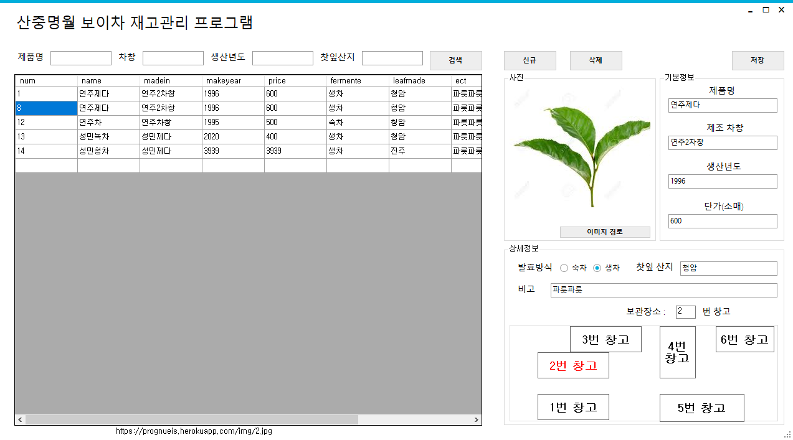

# 창고 재고관리 프로그램
> C# winform 기반으로 한 재고관리 프로그램(찻집용)

## 설명

MYSQL DB 기반(AWS DB서버 사용) 재고관리 프로그램

기능 : 검색, 자료추가 및 편집, 보관장소 표현, 이미지

## 사용 프레임워크 및 라이브러리

MetroUI Winform 디자인, .net framework4.7 기반

## 제작 정보

툴 : VS2019

제작자 : 이성민

제작기간 : 2일
